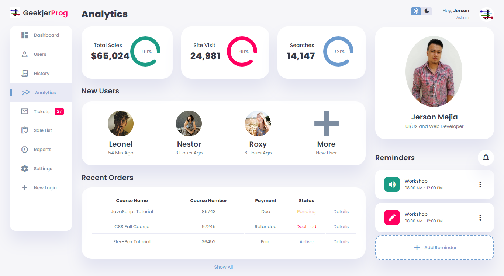

# Responsive Admin Dashboard Design #01
I will to use modern HTML, CSS, and JavaScript to create a completely responsive admin dashboard with light and dark mode theme functionality. We'll be using CSS Variables, CSS Grid, CSS Flexbox, Media queries for our responsive design, and CSS  transitions and animations for some cool animation effects.

# Screenshot
Here we have project screenshot :

White

Black

